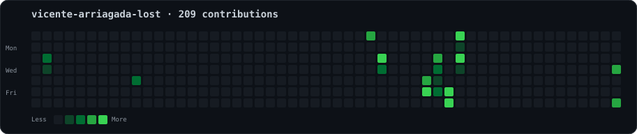

<div align="center">

# `vicente@github ~ $`

```text
┌──────────────────────────────────────────────────────────────┐
│                    CONTRIBUTION HEATMAP                     │
└──────────────────────────────────────────────────────────────┘
```



<br>

<table>
<tr>
<td width="50%" align="center">


</td>
<td width="50%" align="left">



</td>
</tr>
</table>

<br>

```text
┌──────────────────────────────────────────────────────────────┐
│                  SYSTEM ONLINE                              │
│                                                              │
│  Linux • Cybersecurity • Software Development • CTF         │
└──────────────────────────────────────────────────────────────┘
```

</div>
